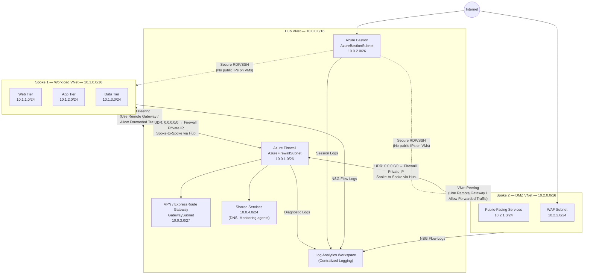

# Enterprise Azure Hub-and-Spoke Network Architecture

Production-grade hub-and-spoke network topology demonstrating enterprise networking patterns used by organizations migrating to or operating in Azure. This project provisions a fully segmented, centrally routed multi-VNet environment with Azure Firewall, Azure Bastion, private DNS, NSG-based micro-segmentation, centralized logging, and Azure Policy governance — all defined as infrastructure-as-code with Terraform.

---

## Table of Contents

- [Architecture Overview](#architecture-overview)
- [Skills Demonstrated](#skills-demonstrated)
- [Prerequisites](#prerequisites)
- [Quick Start](#quick-start)
- [Project Structure](#project-structure)
- [Cost Considerations](#cost-considerations)
- [Cleanup](#cleanup)

---

## Architecture Overview

The hub-and-spoke model centralizes shared network services (firewall, bastion, DNS, logging) in a single hub VNet while workloads live in isolated spoke VNets. All inter-spoke traffic transits the hub, enforcing consistent inspection and policy application at a single chokepoint rather than maintaining bilateral trust between every spoke pair.



### Traffic Flow Summary

| Source | Destination | Path |
|--------|-------------|------|
| Internet | DMZ (WAF) | Direct to SPOKE2, WAF subnet, filtered by NSG |
| SPOKE2 | SPOKE1 | SPOKE2 UDR → Hub Firewall → Hub peering → SPOKE1 |
| SPOKE1 | Internet | SPOKE1 UDR → Hub Firewall → Firewall SNAT |
| Admin workstation | VMs in any spoke | Azure Bastion (HTTPS 443) → Hub → Spoke VM |
| On-premises | Any spoke | ExpressRoute/VPN GW → Hub → Peering → Spoke |

All spoke-to-spoke traffic transits Azure Firewall in the hub. No direct spoke-to-spoke peering exists. This means every cross-spoke connection can be logged, filtered, and blocked centrally without touching individual spoke configurations.

---

## Skills Demonstrated

### Network Design
- **Azure VNet design and IP address planning** — Non-overlapping RFC 1918 address spaces planned across hub and spokes to support future growth and on-premises connectivity without re-addressing
- **Subnet segmentation** — Dedicated subnets per Azure service (Firewall, Bastion, Gateway) and per application tier (web, app, data), each with its own NSG
- **NSG rule design** — Least-privilege inbound/outbound rules per subnet, with explicit deny-all defaults and application-specific allow rules using service tags and ASGs

### Connectivity and Routing
- **VNet peering** — Hub-to-spoke peerings configured with `allow_forwarded_traffic`, `allow_gateway_transit` (hub side), and `use_remote_gateways` (spoke side) to enable centralized routing
- **Azure Firewall** — DNAT, network, and application rule collections enforcing inter-spoke and egress policies; threat intelligence feed enabled
- **User-Defined Routes (UDR)** — Custom route tables attached to every spoke subnet forcing all traffic (0.0.0.0/0 and inter-RFC-1918 prefixes) to the Azure Firewall private IP as the next hop
- **Azure Bastion** — Standard tier Bastion deployed in the hub for RDP/SSH access to VMs in all spokes without exposing public IPs; session recording enabled

### DNS and Service Discovery
- **Azure Private DNS zones** — Private zones linked to hub and both spokes for internal name resolution across VNets; auto-registration enabled on spoke VNets
- **Custom DNS configuration** — VNets configured to use Azure-provided DNS with Private DNS zone integration for seamless `*.internal.contoso.com` resolution

### Observability and Governance
- **Centralized logging with Log Analytics** — Single Log Analytics workspace receiving NSG flow logs, Azure Firewall diagnostic logs, Bastion session logs, and VM agent data
- **Azure Monitor and KQL** — Workbook-style KQL queries for traffic analysis, denied-connection alerting, and firewall rule hit counts
- **Azure Policy for governance** — Built-in and custom policy definitions assigned at the resource group scope enforcing NSG attachment, approved regions, and tagging requirements
- **Compliance reporting** — Policy assignment with remediation tasks to bring non-compliant resources into alignment

### Infrastructure as Code
- **Terraform** — All resources defined in modular Terraform, split by concern (hub, spokes, peering, routing, dns, policy); remote state in Azure Blob Storage
- **Variable-driven configuration** — No hardcoded values; all IP ranges, naming prefixes, SKUs, and region are driven by `terraform.tfvars`

---

## Prerequisites

| Tool | Minimum Version | Purpose |
|------|----------------|---------|
| Azure CLI | 2.55.0 | Authentication, resource group creation |
| Terraform | 1.7.0 | Infrastructure provisioning |
| Azure subscription | — | Target deployment environment |
| Contributor role | — | Required on the target subscription or resource group |

**Install Azure CLI** (Ubuntu/Debian):
```bash
curl -sL https://aka.ms/InstallAzureCLIDeb | sudo bash
az login
az account set --subscription "<your-subscription-id>"
```

**Install Terraform** (via tfenv):
```bash
git clone https://github.com/tfutils/tfenv.git ~/.tfenv
echo 'export PATH="$HOME/.tfenv/bin:$PATH"' >> ~/.bashrc && source ~/.bashrc
tfenv install 1.7.5
tfenv use 1.7.5
```

---

## Quick Start

```bash
# 1. Clone the repository
git clone https://github.com/<your-username>/azure-hub-spoke-network.git
cd azure-hub-spoke-network

# 2. Create a terraform.tfvars file from the example
cp terraform/terraform.tfvars.example terraform/terraform.tfvars

# 3. Edit the tfvars — set your subscription ID, prefix, and region
$EDITOR terraform/terraform.tfvars

# 4. Create the remote state storage account (one-time setup)
bash scripts/bootstrap-state.sh

# 5. Initialize Terraform
cd terraform
terraform init

# 6. Review the execution plan
terraform plan -out=tfplan

# 7. Deploy the infrastructure
terraform apply tfplan
```

After a successful apply, Terraform outputs the public IP of Azure Bastion, the firewall private IP, and the Log Analytics workspace ID.

```bash
# View outputs
terraform output
```

---

## Project Structure

```
azure-hub-spoke-network/
├── README.md
├── WALKTHROUGH.md
├── docs/
│   └── screenshots/               # Walkthrough screenshot references
├── network-diagrams/              # Exported draw.io / Visio diagrams
├── policies/
│   ├── azure-policy-definitions/  # Custom policy definition JSON files
│   └── nsg-rules/                 # Reusable NSG rule JSON templates
├── scripts/
│   ├── bootstrap-state.sh         # Creates Azure Storage for Terraform remote state
│   ├── test-connectivity.sh       # Runs curl/ping/nc tests from within VMs
│   └── query-logs.sh              # Helper to run KQL queries via az monitor
└── terraform/
    ├── main.tf                    # Root module — providers, backend, module calls
    ├── variables.tf               # Input variable declarations
    ├── outputs.tf                 # Output values
    ├── terraform.tfvars.example   # Example variable values (no secrets)
    ├── modules/
    │   ├── hub/                   # Hub VNet, subnets, Firewall, Bastion, GW
    │   ├── spoke-workload/        # Spoke 1 VNet, subnets, NSGs, route table
    │   ├── spoke-dmz/             # Spoke 2 VNet, subnets, NSGs, route table
    │   ├── peering/               # VNet peering resources (both directions)
    │   ├── routing/               # UDRs and route table associations
    │   ├── dns/                   # Private DNS zones and VNet links
    │   ├── logging/               # Log Analytics workspace, diagnostic settings
    │   └── policy/                # Policy definitions and assignments
    └── test-vms/                  # Optional: B1s VMs for connectivity testing
```

---

## Cost Considerations

Running this architecture in full costs approximately **$3–6 USD per hour**, dominated by Azure Firewall (~$1.25/hr for the Standard SKU). The table below breaks down the primary cost drivers.

| Resource | SKU | Estimated Cost |
|----------|-----|----------------|
| Azure Firewall | Standard | ~$1.25/hr + data processing |
| Azure Bastion | Standard | ~$0.49/hr |
| VPN Gateway | VpnGw1 (optional) | ~$0.19/hr |
| Log Analytics | Pay-as-you-go ingestion | ~$2.30/GB ingested |
| VNet peering | — | $0.01/GB transferred |
| Test VMs (x2 B1s) | B1s | ~$0.021/hr each |

**Reducing lab costs:**

- **Skip Azure Firewall** and substitute a Linux VM running `iptables`/`nftables` as a software firewall (NVA pattern). This reduces the hourly cost by ~75% and is a legitimate architecture pattern for smaller organizations.
- **Use Azure Bastion Basic** tier instead of Standard if session recording is not required.
- **Tear down when not in use** — the cleanup section below shows how to destroy everything in under two minutes.
- **Use spot/preemptible VMs** for the test virtual machines.

---

## Cleanup

All resources are tagged with `managed-by = terraform` and the project prefix, making bulk cleanup straightforward.

```bash
cd terraform

# Destroy all provisioned resources
terraform destroy

# Confirm by typing 'yes' when prompted
```

If you want to destroy only a specific module (e.g., test VMs) without tearing down the whole network:

```bash
terraform destroy -target=module.test_vms
```

After destroying, remove the remote state storage account if it is no longer needed:

```bash
bash scripts/cleanup-state.sh
```

> **Note:** Azure Firewall and Azure Bastion can take 5–10 minutes to deprovision. The `terraform destroy` command will wait for completion automatically.
