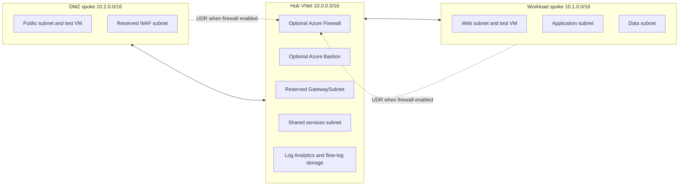

# Azure Hub-and-Spoke Network

> **Status: archived reference.** This repository is an infrastructure design exercise, not a currently deployed or supported environment. It has no verified live deployment, benchmark results, screenshots, or production operating history.

Terraform for a three-VNet Azure lab: one hub, one workload spoke, and one DMZ spoke. The configuration explores centralized routing, network segmentation, private DNS, Azure Firewall, Bastion, and network telemetry.

## What is implemented

- Three resource groups and VNets with non-overlapping address spaces
- Hub subnets reserved for Azure Firewall, Bastion, a future gateway, and shared services
- Workload web, application, and data subnets with separate NSGs
- DMZ public and reserved WAF subnets with separate NSGs
- Bidirectional hub-to-spoke VNet peerings; there is no direct spoke-to-spoke peering
- Optional Azure Firewall and Bastion resources
- Firewall-backed user-defined routes when the firewall is enabled
- Two private test VMs, one in each spoke
- A Private DNS zone linked to all three VNets
- Log Analytics, diagnostic settings, Network Watcher flow logs, and a storage account
- Example Azure Policy and NSG JSON files under `policies/`

The configuration is flat Terraform split by concern. It is not organized into reusable modules.

## What is not implemented

The repository does **not** contain:

- a VPN or ExpressRoute gateway (only a reserved `GatewaySubnet`)
- an Application Gateway or WAF (only a reserved `snet-waf` and related NSG rules)
- Terraform-managed Azure Policy definitions, assignments, or remediation tasks
- a remote-state bootstrap script; `terraform/backend.tf` contains only a commented example
- exported diagrams, screenshots, KQL workbooks, or production evidence
- automated apply or destroy workflows
- evidence that the current provider/API combination has been applied successfully

Those boundaries matter: the code should be reviewed as a lab artifact, not as a production-ready Azure landing zone.

## Topology represented by the code


```mermaid
flowchart LR
    subgraph HUB[Hub VNet 10.0.0.0/16]
      FW[Optional Azure Firewall]
      BAS[Optional Azure Bastion]
      GWS[Reserved GatewaySubnet]
      SS[Shared services subnet]
      LOG[Log Analytics and flow-log storage]
    end

    subgraph WORKLOAD[Workload spoke 10.1.0.0/16]
      WEB[Web subnet and test VM]
      APP[Application subnet]
      DATA[Data subnet]
    end

    subgraph DMZ[DMZ spoke 10.2.0.0/16]
      PUB[Public subnet and test VM]
      WAF[Reserved WAF subnet]
    end

    HUB <--> WORKLOAD
    HUB <--> DMZ
    WORKLOAD -. UDR when firewall enabled .-> FW
    DMZ -. UDR when firewall enabled .-> FW
```

The peerings allow forwarded traffic. Hub peerings advertise gateway transit, but spoke peerings keep `use_remote_gateways = false` because no gateway resource exists.

## Review without creating resources

Terraform 1.7 or newer is required. These commands download the AzureRM provider but do not authenticate to Azure or change cloud resources:

```bash
cd terraform
terraform fmt -check -recursive
terraform init -backend=false
terraform validate
```

Pull requests run the same static validation plus tfsec. CI deliberately has read-only repository permissions and receives no Azure credentials.

## Reproducing the lab

Deployment is intentionally manual because the configuration creates paid Azure resources and includes security choices that need environment-specific review.

1. Fork the repository and review every Terraform resource and NSG rule.
2. Create `terraform/terraform.tfvars` from the example. Keep it untracked and supply a unique, strong test-VM password through an appropriate secret workflow.
3. Configure an AzureRM backend yourself or explicitly accept local state for a disposable lab.
4. Authenticate with the least-privileged Azure identity suitable for your subscription.
5. Run `terraform plan` and inspect the complete plan, including estimated regional costs.
6. Apply only in a disposable subscription, then destroy and verify every resource is gone.

The included `scripts/deploy.sh` and `scripts/destroy.sh` are interactive convenience scripts. They can create or remove paid resources; neither is called by CI.

## Known limitations and risks

- Password authentication is enabled on both test VMs. A maintained design should use SSH keys or another passwordless access path.
- Several ingress and firewall rules are intentionally broad for a lab, including public HTTP/HTTPS rules and wildcard outbound web access. Narrow them to explicit sources, destinations, and services before reuse.
- The storage account and telemetry configuration need a fresh privacy, retention, networking, and regional-compliance review.
- NSG flow logs and provider schemas evolve; confirm current Azure support before planning.
- The sample policy JSON is not wired into Terraform and therefore enforces nothing.
- Disabling Azure Firewall removes the UDRs, so traffic behavior is materially different.
- There is no automated connectivity, failover, policy, restore, or destruction verification.
- Cost figures are omitted because Azure prices vary by region and change over time. Use the official Azure pricing calculator before any apply.

For an evidence-focused reading guide, see [WALKTHROUGH.md](WALKTHROUGH.md). Security reporting guidance is in [SECURITY.md](SECURITY.md).

## License

MIT. See [LICENSE](LICENSE).
